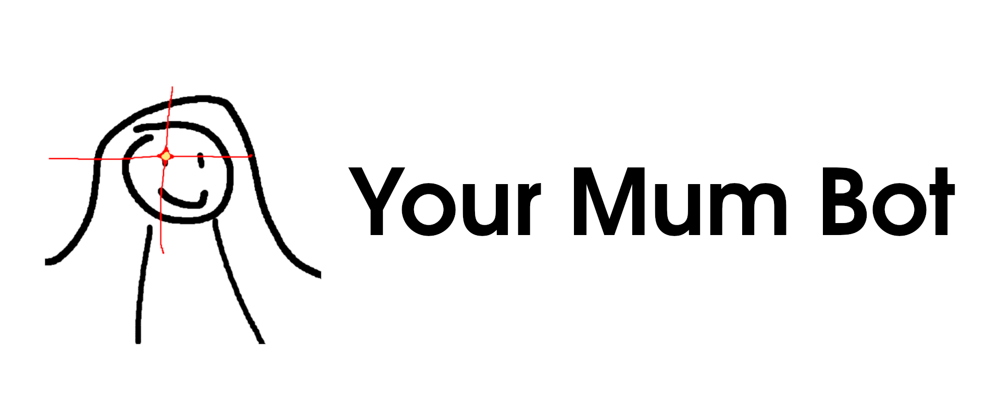

<!-- omit in toc -->
<p align="center">
    
</p>

# YourMumBot

YourMumBot is a discord bot that reads at text sent by 
users in a discord channel, and makes your mum jokes from them.

<!-- omit in toc -->
# :warning: DISCLAIMER :warning:

**THIS MODEL IS PURPOSEFULLY DESIGNED TO BE INSULTING.**

**THIS BOT IS CREATED FOR COMEDIC PURPOSES ONLY. PLEASE BE AWARE THAT 
CONTENT SENT BY YOURMUMBOT CAN BE VERY OFFENSIVE.**

**DO NOT** use this bot if anyone in the server would find it offensive / 
inappropriate.

I am **NOT** responsible for misuse of this bot / code. Misuse includes 
but is not limited to: 
- Using this bot to offend someone
- Using this bot in situations where someone would find it offensive
- Causing undesired results by using this code


<!-- omit in toc -->
## Table of contents
- [YourMumBot](#yourmumbot)
  - [Up and Running](#up-and-running)
  - [Sample outputs](#sample-outputs)
  - [How it works](#how-it-works)
    - [Pipeline](#pipeline)
  - [Discord Bot](#discord-bot)
    - [No of requests](#no-of-requests)
    - [Input size](#input-size)
    - [Latency](#latency)
  - [API](#api)
    - [Endpoint](#endpoint)
    - [Responses](#responses)
  - [Run your own API / Bot](#run-your-own-api--bot)
    - [Pre-Built Docker Images](#pre-built-docker-images)
    - [Memory requirements](#memory-requirements)

## Up and Running

Add `Your Mum` to your discord channel!

Click here :point_down:

[](https://discord.com/api/oauth2/authorize?client_id=856211082720444456&permissions=68608&scope=bot)

Try the API endpoint: [here](http://46.101.67.210/docs)

[](https://www.digitalocean.com/?refcode=8d8bfeea8b4f&utm_campaign=Referral_Invite&utm_medium=Referral_Program&utm_source=badge)

## Sample outputs

```
User: Flat earthers think that the earth is flat
Bot: Flat earthers think that your mum is flat

User: League of legends is such a shit game
Bot: Your mum is such a shit game

User: Today is a good day. You are very tall.
Bot: Today is your mum. Your mum is very tall.
```

## How it works

YourMumBot makes use of 3 main NLP models / tools:
1. [Stanford CoreNLP](https://stanfordnlp.github.io/CoreNLP/) 
via [stanza](https://stanfordnlp.github.io/stanza/corenlp_client.html)
2. [Detoxify](https://github.com/unitaryai/detoxify)
3. [Language tools](https://github.com/jxmorris12/language_tool_python)

### Pipeline

1. The `CoreNLP` library 
[constituency parser](https://stanfordnlp.github.io/CoreNLP/parse.html)
is used to 
identify noun phrases (NP) in an input sentence. 
2. These NPs serves as potential places in the sentence where we can
substitute the NP with the string `your mum`. This works surprisingly 
well.
3. For each of these potential substitutions, we use `Detoxify` to 
rate the toxicity of the sentence. We then pick the sentence 
that has the highest toxicity.
4. At various points while processing the input, `language tools` 
is used to correct grammatical mistakes of the (potential) 
output sentences. 

    For example, this might be due to substitution of 
    `you` with `your mum` in `You are very tall`, which leads 
    to the grammatically incorrect output `your mum are very tall`.

    `language tools` tries to fix this problem.

## Discord Bot

### No of requests

YourMumBot is currently hosted on a small droplet on Digital Ocean. 
YourMumBot will only process at most 1 requests at the same time. Any other requests will be ignored.

### Input size

YourMumBot only processes user inputs that are 
shorter than 150 characters and shorter than 
25 words. This is to ensure quick processing for 
low latency and prevent a single request to 
hog to server.

### Latency

Latency is usually around 500-1000 ms.

## API

### Endpoint

There is an api endpoint available at [http://46.101.67.210/yourmumify](http://46.101.67.210/docs). 
Docs a can be read via [this link](http://46.101.67.210/docs)

### Responses

Response code
- `200`: Request was successful.
- `422`: Request body is not valid:
  - `msg` can only contain ascii characters.
  - `msg` length must be less than or equal to `150` characters.
  - `msg` must contain than or equal to `25` words.
- `500`: Internal server error. Please post an issue.
- `503`: Server busy processing another request. (It can only process one request at a time.)

## Run your own API / Bot

Source code is available here. 

To run do

```console
docker-compose up -d
```

### Pre-Built Docker Images

- [API Docker Hub](https://hub.docker.com/repository/docker/andylolu24/yourmum-api)
- [Bot Docker Hub](https://hub.docker.com/repository/docker/andylolu24/yourmum-bot)

### Memory requirements

1 GB of RAM is barely sufficient to run all related services for this model.
Swap file is needed to prevent Out-Of-Memory errors.
