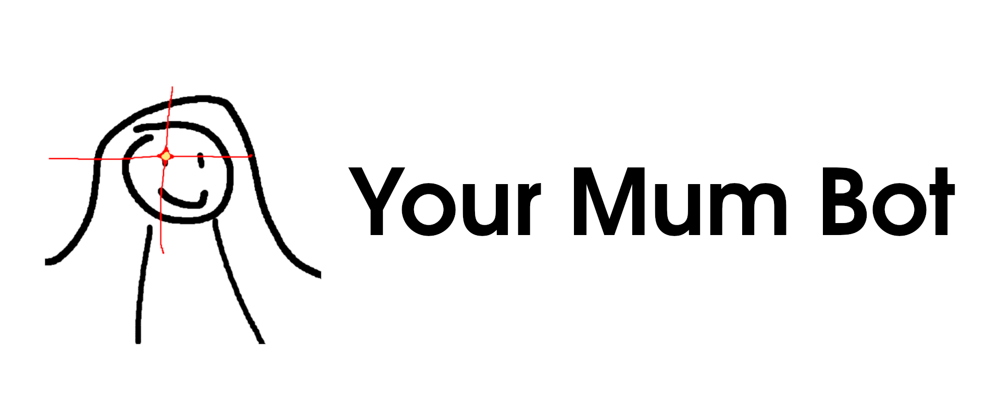
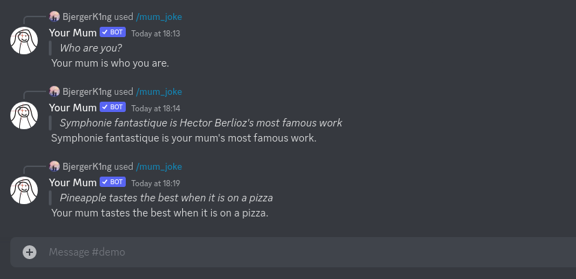

<p align="center">
    <a href="https://discord.com/api/oauth2/authorize?client_id=856211082720444456&permissions=2048&scope=applications.commands%20bot" target="_blank">
        
    </a>
</p>

<!-- omit in toc -->
# YourMumBot

YourMumBot is a discord bot that reads at text sent by 
users in a discord channel, and makes your mum jokes from them.

<!-- omit in toc -->
# :warning: DISCLAIMER :warning:

**THIS MODEL IS PURPOSEFULLY DESIGNED TO BE INSULTING.**

**THIS BOT IS CREATED FOR COMEDIC PURPOSES ONLY. PLEASE BE AWARE THAT 
CONTENT SENT BY YOURMUMBOT CAN BE VERY OFFENSIVE.**

**DO NOT** use this bot if anyone in the server would find it offensive / 
inappropriate.

<!-- omit in toc -->
## Table of contents
- [Up and running](#up-and-running)
- [Demo](#demo)
- [How it works](#how-it-works)
- [Discord bot](#discord-bot)
  - [No of requests](#no-of-requests)
  - [Input size](#input-size)
  - [Latency](#latency)
- [Run your own endpoint](#run-your-own-endpoint)
- [Privacy policy](#privacy-policy)


## Up and running

Add **Your Mum** to your discord channel!

Click here :point_down:

[](https://discord.com/api/oauth2/authorize?client_id=856211082720444456&permissions=2048&scope=applications.commands%20bot)

## Demo



## How it works

From v2.0.0 onwards, **Your Mum** is now powered by [Cohere](https://cohere.ai/)! On a more technical level, the bot is now creating your mum jokes by leveraging few-shot learning capabilities of large language models. The large language model is hosted by Cohere and this bot simply calls their API. For detailed information about the model itself, please view their [model card](https://docs.cohere.ai/docs/generation-card). 

To help the language model learn how to create your mum jokes, a few examples have been given to it in its prompt, these examples can been found in the [config.json](packages/bot/your_mum/config.json) file.


## Discord bot

### No of requests

At the moment, this app relies on accessing the Cohere API via a trial key, which is rate limited to 100 requests per minute. So it will not be able to handle any higher rate of requests than that. 

### Input size

The prompt is limited to 200 characters. This is done to ensure reasonable response time. 

### Latency

Response time is typically between 1 - 5 seconds.

## Run your own endpoint

Source code is available here. To setup, you will need to create two local files `.prod.env` and `.dev.env`, both following the format below:

```Shell
DISCORD_PUBLIC_KEY=<your-discord-app-public-key>
DISCORD_APP_ID=<your-discord-app-id>
DISCORD_BOT_TOKEN=<your-discord-bot-token>
LOGTAIL_HTTP_SOURCE_TOKEN=<your-logtail-http-source-token>
COHERE_API_KEY=<your-cohere-api-key>
```

where `.dev.env` contains the development versions of these keys, and `.prod.env` contains the production versions. Some of the values can be the values are shared in both development and production.

## Privacy policy

The privacy policy is available [here](static/docs/privacy-policy.md).
